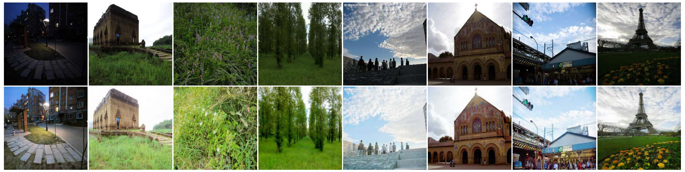

# SDA-Net

## Low-Light Image Enhancement via Self-Degradation-Aware and Semantic-Perceptual Guidance Networks
### Authors: O. Sedeeq Ahmad, S.A. Anjuman, S. Sulaiman, Ako Bartani
### Published in: Knowledge-Based Systems (2025)

### If you see this message, it means we are uploading our codes, please do not download them.

#### This paper proposed SDA-Net, a self-degradation-aware enhancement framework that dynamically adapts enhancement strategies to varying low-light conditions. Our method introduces two key components: (1) a Contrastive-Based Degradation Feature Extractor, which learns discriminative representations of degradation, enabling adaptive enhancement tailored to degradation features. This degradation-aware approach enhances stability and performance in different low-light scenarios. (2) a Semantic-Perceptual Guidance Network, which generates intermediate visual representations to amplify inputs. These representations serve as prior knowledge to enhance the images, enabling sharper edge reconstruction, effective noise suppression, and the preservation of natural illumination.



## Requirements
```
-Python 3.8+
-PyTorch >= 1.10 (CUDA-enabled for GPU training)
-torchvision
-numpy, scipy, pillow
-opencv-python
-cikit-image
-tqdm, matplotlib
```

## Dataset preparation
We used a Mixed of LOL and MIT-Adobe FiveK dataset.
```
datasets/
├── train/
│   ├── low/
│       ├── LOL
│       └── FiveK
│   └── high/
│       ├── LOL
│       └── FiveK
└── test/
    ├── DICM/
    ├── LIME/
    ...
    └── LOL/
```
You can use the same structure for your data. For this, you need to change the path of the training and test data in the "/data/dataset_config.py".
```
TRAIN_PTH = "datasets/train/low/*"
TEST_PATH = "datasets/test/*"
```

## Train Model
If you want to train the model on new data, we recommend that retrain the both CBDFE and SPG model on new data. To this end, run the "cues_train.py" and "CBDFE_train.py" using new data. Next, run the "train.py" on new dataset.

Otherwise, you can use pre-trained weights on defined dataset. You can download weights: [download link](https://drive.google.com/drive/folders/19ap6Sacju8OUXn71ZI_XGkbY9gsGGBiM?usp=sharing). 

Please pot downloaded files in the path "weights/" and ensure that in the config.py: 
```
LOAD_checkpoints = True
```

## Test Model
To test model:

1: ensure that  the model "weights/" are in the weights folder. ([download link](https://drive.google.com/drive/folders/19ap6Sacju8OUXn71ZI_XGkbY9gsGGBiM?usp=sharing).)

2: in the config.py:
```
LOAD_checkpoints = True
```

3: please create new folder in "datasets/test/" path and insert your low-light images on it. Next, change the TEST_PATH in "data/dataset_config.py"
```
TEST_PATH = "datasets/test/*"
```

4: run the "test.py". you can finde the model output in "outcomes/enhanced" path


## Citation
If you use this code or the method in your research, please cite our paper:
```
@article{sedeeq2025low,
  title={Low-Light Image Enhancement via Self-Degradation-Aware and Semantic-Perceptual Guidance Networks},
  author={Sedeeq, Omed and Anjuman, Sarbast Ahmed and Sulaiman, Sarhang and Bartani, Ako},
  journal={Knowledge-Based Systems},
  pages={114571},
  year={2025},
  publisher={Elsevier}
}
```
## Contacts
For any inquiries contact Ako Bartani: <a href="mailto:a.bartani@uok.ac.ir">a.bartani [at] uok.ac.ir</a>

